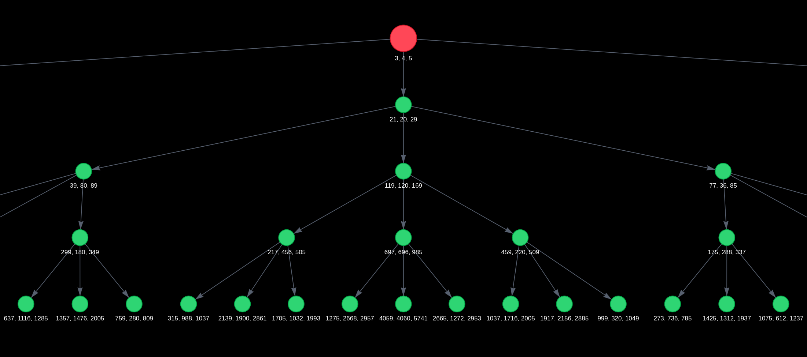

# 📐 Tree of Pythagorean Triples Generator

A tool for generating and visualizing the ternary tree of **primitive Pythagorean triples** (Berggren's Tree). 

---

## 📊 Visualization Result

The program generates an HTML graph. Below is an example of the generated tree structure:

<p align="center">
  
</p>

---

## 🧬 How It Works

1. **Mathematical Core (C):** Starting from the root triple `(3, 4, 5)`, the algorithm uses three Berggren linear transformation matrices ($A, B, C$). A recursive function performs a depth-first search (DFS) traversal of the tree, calculates new coprime triples, and saves the parent-child relationships.
2. **Parsing and Orchestration (Python):** A Python script automatically compiles and runs the C code via `subprocess`, captures the output, and builds the graph.
3. **Frontend (Pyvis):** A standalone HTML file `index.html` is generated using the `vis.js` physics engine.

---

## 🛠️ Tech Stack

- **Core:** `C` 
- **Scripting / Graph:** `Python 3`
- **Libraries:** `pyvis`
- **Compiler:** `GCC`

---

## 🚀 Quick Start

### Requirements
- `gcc` compiler in your system path (PATH)
- `Python 3.x` installed

### 1. Clone and Install Dependencies
```bash
git clone https://github.com
cd tree-of-pythagorean-triples
pip install pyvis
```

### 2. Run the Project
Simply run the main Python automation script:
```bash
python main.py
```
The script will automatically compile the `pif3.c` file, perform the calculations, and create the `index.html` file.

### 3. View the Results
Open the generated `index.html` file in any modern web browser to interact with the interactive tree map.

---

## 📐 Matrix Transformations

For each tree node, 3 child elements are calculated using the formula $v_{child} = T_i \cdot v_{parent}$, where $T_i$ is one of the following matrices:

$$
A = \begin{pmatrix} 
1 & -2 & 2 \\ 
2 & -1 & 2 \\ 
2 & -2 & 3 
\end{pmatrix}, \quad
B = \begin{pmatrix} 
1 & 2 & 2 \\ 
2 & 1 & 2 \\ 
2 & 2 & 3 
\end{pmatrix}, \quad
C = \begin{pmatrix} 
-1 & 2 & 2 \\ 
-2 & 1 & 2 \\ 
-2 & 2 & 3 
\end{pmatrix}
$$

